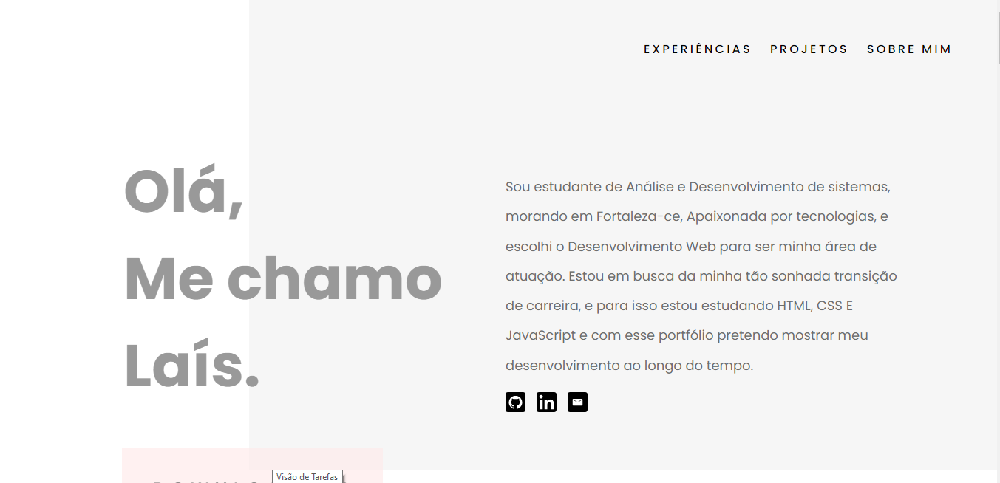
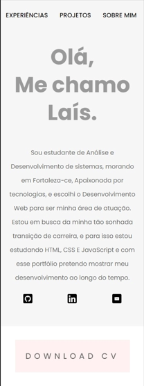

<h1 align="center">
  💻 Meu Portfólio
</h1>

<h4 align="center">
  Portfólio criado com o intuito de mostrar meus projetos. E também foi um dos desafios proposto pela mentoria do programa "DESENVOLVE 2022" do grupo O Boticário.
</h4>

---

<h3>VERSÃO WEB</h3>

<h3>VERSÃO MOBILE</h3>

<table align="center">
  <tr>
    <td align="center">
      <a href="https://github.com/laisfrr">
         
      </a>
    </td>
  </tr>
</table>

## <h4 align="center"><a href="https://www.figma.com/file/3xMjJ5KGTQxfeEdZt1PH1d/Portfolio-Template-(Community)?node-id=0%3A1">Clique para visitar o projeto no FIGMA</a></h4>

---

## ✅ O site é composto por :

-   **Home:** Nele temos uma breve apresentação;
-   **Experiências:** Nessa seção falo sobre minhas experiências profissionais;
-   **Projetos:** Apresenta alguns projetos desenvolvidos e com link direto para os códigos no GitHub;
-   **Sobre Mim:** Onde falo um pouco mais sobre mim e sobre minhas expectativas, objetivos e onde quero chegar.

---

## ⚙ Tecnologias utilizadas

-   HTML;
-   CSS;

---

## ⚠ Dificuldades durante o projeto

-   Aplicar responsividade
-   Alinhas elementos com CSS
-   Sobrepor alguns elementos usando CSS

---

## 👩 Autor(a) 

<table align="center">
  <tr>
    <td align="center">
      <a href="https://github.com/laisfrr">
         
        
          <b>Laís Oliveira</b>
        
      </a>
    </td>
  </tr>
</table>
